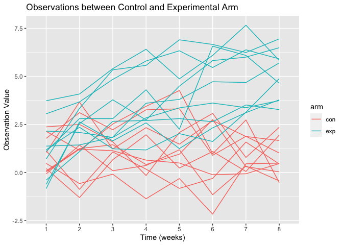

p8105_hw5_lh3109
================

# Probelm 1

From Office Hour

## Tidy data

``` r
homicide_df = 
  #load and clean data
  read_csv("./data/homicide-data.csv", na = c("", "Unkown")) %>% 
  mutate(
    #create a new variable: city_state
    city_state = str_c(city, state),
    #create a new variable: resolution
    resolution = case_when(
      disposition == "Closed without arrest" ~ "unsolved",
      disposition == "Open/No arrest" ~ "unsolved",
      disposition == "Closed by arrest" ~ "solved"
    )) %>% 
  #change column position
  relocate(city_state) %>% 
  #filter out data entry error
  filter(city_state != "TulsaAL")
```

    ## Rows: 52179 Columns: 12

    ## ── Column specification ────────────────────────────────────────────────────────
    ## Delimiter: ","
    ## chr (9): uid, victim_last, victim_first, victim_race, victim_age, victim_sex...
    ## dbl (3): reported_date, lat, lon

    ## 
    ## ℹ Use `spec()` to retrieve the full column specification for this data.
    ## ℹ Specify the column types or set `show_col_types = FALSE` to quiet this message.

Describe the raw data

## Baltimore, MD

``` r
#load data
baltimore_df = 
  homicide_df %>% 
  #filter data from Baltimore, MD
  filter(city_state == "BaltimoreMD")

baltimore_summary = 
  baltimore_df %>% 
  #summarize data
  summarize(
    #sum number pf unsolved homocides
    unsolved = sum(resolution == "unsolved"),
    #sum number of rows
    n = n()
  )

#perform proportion test
baltimore_test = 
  prop.test(x = baltimore_summary %>%  pull(unsolved),
          n = baltimore_summary %>%  pull(n))

#convert the test result to a better workable format
baltimore_test %>% 
  broom::tidy()
```

    ## # A tibble: 1 × 8
    ##   estimate statistic  p.value parameter conf.low conf.high method    alternative
    ##      <dbl>     <dbl>    <dbl>     <int>    <dbl>     <dbl> <chr>     <chr>      
    ## 1    0.646      239. 6.46e-54         1    0.628     0.663 1-sample… two.sided

## Iteration

write a function

``` r
prop_test_function = function(city_df) {
  #summarize data
  city_summary = 
    city_df %>% 
    summarize(
      #sum number pf unsolved homicides
      unsolved = sum(resolution == "unsolved"),
      #sum number of rows
      n = n()
      )
  
  #perform statistical test
  city_test = 
  prop.test(
    x = city_summary %>%  pull(unsolved),
    n = city_summary %>%  pull(n))
  
  #return
  return(city_test)
}

prop_test_function(baltimore_df)
```

    ## 
    ##  1-sample proportions test with continuity correction
    ## 
    ## data:  city_summary %>% pull(unsolved) out of city_summary %>% pull(n), null probability 0.5
    ## X-squared = 239.01, df = 1, p-value < 2.2e-16
    ## alternative hypothesis: true p is not equal to 0.5
    ## 95 percent confidence interval:
    ##  0.6275625 0.6631599
    ## sample estimates:
    ##         p 
    ## 0.6455607

``` r
#test the function
homicide_df %>% 
  filter(city_state == "AlbuquerqueNM") %>% 
  prop_test_function()
```

    ## 
    ##  1-sample proportions test with continuity correction
    ## 
    ## data:  city_summary %>% pull(unsolved) out of city_summary %>% pull(n), null probability 0.5
    ## X-squared = 19.114, df = 1, p-value = 1.232e-05
    ## alternative hypothesis: true p is not equal to 0.5
    ## 95 percent confidence interval:
    ##  0.3372604 0.4375766
    ## sample estimates:
    ##         p 
    ## 0.3862434

iterate across all cities

``` r
result_df = 
  homicide_df %>% 
  #nest the data frame
  nest(data = uid:resolution) %>% 
  #create new variables that store the test results
  mutate(
    test_results = map(data, prop_test_function),
    tidy_results = map(test_results, broom::tidy)
  ) %>% 
  select(city_state, tidy_results) %>% 
  #unnest data set
  unnest(tidy_results) %>% 
  select(city_state, estimate, starts_with("conf"))

#test results
#nest_df %>% 
  #filter(city_state == "BaltimoreMD") %>% 
  #pull(tidy_results)
```

A plot showing estimate and confidence interval

``` r
result_df %>% 
  #arrange the data
  mutate(city_state = fct_reorder(city_state, estimate)) %>% 
  #create plot
  ggplot(aes(x = city_state, y = estimate)) + 
  geom_point() + 
  #add error bar
  geom_errorbar(aes(ymin = conf.low, ymax = conf.high)) +
  #adjust labels on x axis
  theme(axis.text.x = element_text(angle = 90, vjust = 0.5, hjust = 1))
```

<!-- -->

Another way for problem 1…

``` r
homicide_df %>% 
  group_by(city_state) %>% 
  summarize(
    unsolved = sum(resolution == "unsolved"),
    n = n()
  ) %>% 
  mutate(
    #mapping two columns at the same time
    test_results = map2(unsolved, n, prop.test),
    tidy_results = map(test_results, broom::tidy)
  ) %>% 
  select(city_state, tidy_results) %>% 
  #unnest data set
  unnest(tidy_results) %>% 
  select(city_state, estimate, starts_with("conf"))
```

    ## # A tibble: 50 × 4
    ##    city_state    estimate conf.low conf.high
    ##    <chr>            <dbl>    <dbl>     <dbl>
    ##  1 AlbuquerqueNM    0.386    0.337     0.438
    ##  2 AtlantaGA        0.383    0.353     0.415
    ##  3 BaltimoreMD      0.646    0.628     0.663
    ##  4 Baton RougeLA    0.462    0.414     0.511
    ##  5 BirminghamAL     0.434    0.399     0.469
    ##  6 BostonMA         0.505    0.465     0.545
    ##  7 BuffaloNY        0.612    0.569     0.654
    ##  8 CharlotteNC      0.300    0.266     0.336
    ##  9 ChicagoIL        0.736    0.724     0.747
    ## 10 CincinnatiOH     0.445    0.408     0.483
    ## # … with 40 more rows

# Problem 2

## Read data from mutiple files

``` r
#obtain a list of file names
filename_df = tibble(
  files = list.files("./data/arm/")
)

#create a function to read data
read_data = function(filename) {
  
  #obtain file path name for different file names
  file_path = str_c("./data/arm/", filename)
  
  data_df =
    #read data form each file
    read_csv(file_path) %>%
    #create id for each data frame
    mutate(id = str_remove(filename, ".csv"))
    
  
  #return data frame
  return(data_df)
}

#iterate over file names and read data in each subject
output = map(filename_df, read_data)
```

    ## Rows: 20 Columns: 8

    ## ── Column specification ────────────────────────────────────────────────────────
    ## Delimiter: ","
    ## dbl (8): week_1, week_2, week_3, week_4, week_5, week_6, week_7, week_8

    ## 
    ## ℹ Use `spec()` to retrieve the full column specification for this data.
    ## ℹ Specify the column types or set `show_col_types = FALSE` to quiet this message.

## tidy results + create plot

``` r
#tidy data
tidy_data = 
  output %>% 
  #change the output list to data frame
  as.data.frame() %>%
  pivot_longer(
    files.week_1:files.week_8,
    names_to = "week",
    names_prefix = "files.week_"
  ) %>% 
  mutate(arm = str_sub(files.id, end = 3))

#create spaghetti plot
tidy_data %>% 
  ggplot(aes(x = week, y = value, group = files.id, color = arm)) +
  geom_line() +
  labs(
    #rename y axis
    y = "Observation Value", 
    #rename x axis
    x = "Time (weeks)", 
    #set a title
    title = "Observations between Control and Experimental Arm"  )
```

<!-- -->

As the plot shows, we can see that most of the patients from the
experimental arm group starts with a lower observational value in week 1
and ends with a much higher observational value by week 8. However,
patients from the control group do not have such a significant change in
observational values comparing to those from the experimental change.
The observational values of the control group, though fluctuate, remain
generally the same after 8 weeks.

# Problem 3
